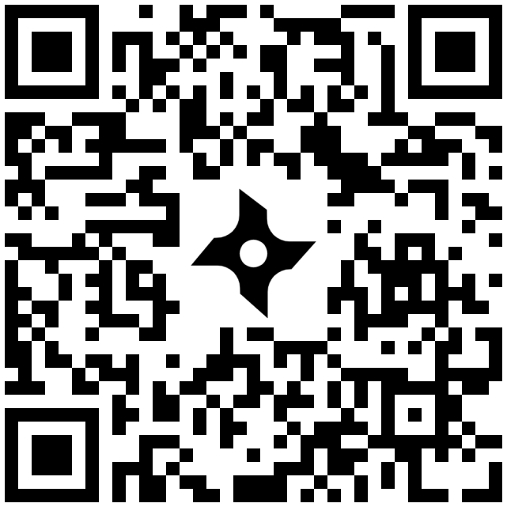
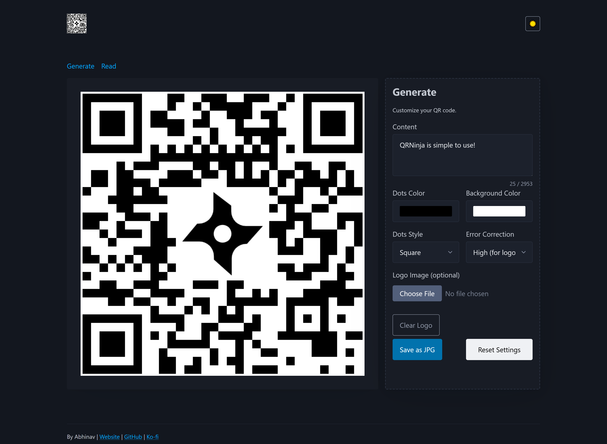

<h1>
  
  QRNinja
</h1>

**Customizable QR code generator and reader — all in browser, no download needed!**

## Features

- Generate QR codes with:
  - Custom content (URLs, text, etc.)
  - Color customization (dots/background)
  - Dots style (e.g., square)
  - Error correction settings
  - Custom logo
- Save QR codes as JPG, PNG
- Read QR codes:
  - Upload an image
  - Scan using your device camera

## 🚀 Live Demo

Try it out: [https://qrninja.xanthis.xyz](https://qrninja.xanthis.xyz)

## Tech Stack

- HTML, JS, [Pico.css](https://picocss.com/), [qr-code-styling](https://www.npmjs.com/package/qr-code-styling), [jsQR](https://www.npmjs.com/package/jsqr)

